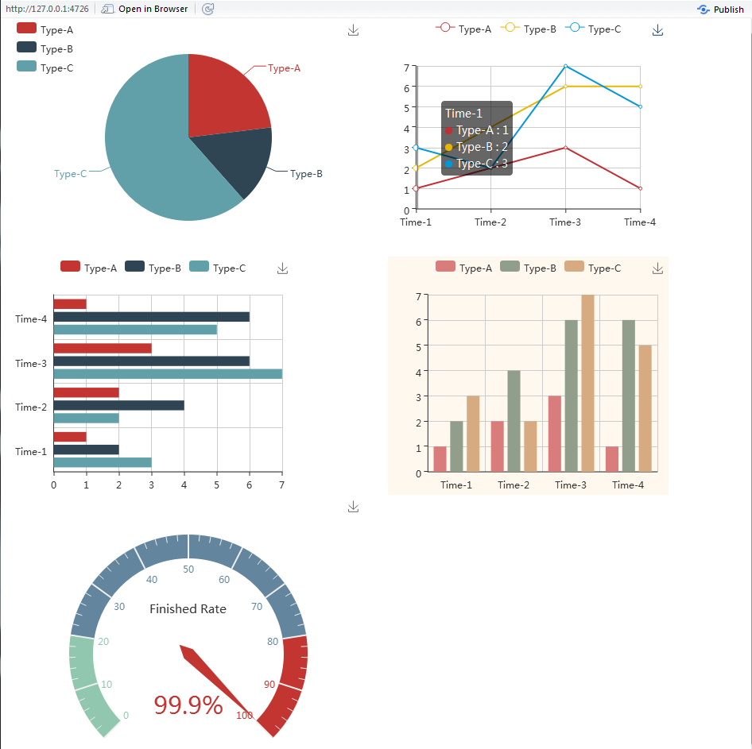

As an R package, *ECharts2Shiny* can help embed the interactive charts plotted by [*ECharts*](https://github.com/ecomfe/echarts) library into our *Shiny* application. Currently, we can support 

- Pie charts
- Line charts
- Bar charts
- Scatter plots
- Radar chart
- Gauge
- Word Cloud
- Heat Map

### Contents
- [How to Install](#how-to-install)
- [Examples](#examples)
- [Note](#note)
- [License](#license)


## How to Install

From CRAN,
```{r, eval=FALSE}
install.packages("ECharts2Shiny")
```

For the latest development version, please install from GitHub
```{r, eval=FALSE}
library(devtools)
install_github("XD-DENG/ECharts2Shiny")
```


## Examples

```{r, eval=FALSE}
library(shiny)
library(ECharts2Shiny)

# Prepare sample data for plotting --------------------------
dat <- data.frame(c(1, 2, 3),
                  c(2, 4, 6))
names(dat) <- c("Type-A", "Type-B")
row.names(dat) <- c("Time-1", "Time-2", "Time-3")

# Server function -------------------------------------------
server <- function(input, output) {
  # Call functions from ECharts2Shiny to render charts
  renderBarChart(div_id = "test", grid_left = '1%', direction = "vertical",
                 data = dat)
}

# UI layout -------------------------------------------------
ui <- fluidPage(
  # We MUST load the ECharts javascript library in advance
  loadEChartsLibrary(),
  
  tags$div(id="test", style="width:50%;height:400px;"),
  deliverChart(div_id = "test")
)

# Run the application --------------------------------------
shinyApp(ui = ui, server = server)
```

```{r, out.width = 400, echo = FALSE}

```


**(For more examples, please refer to the `/examples` folder of the repo on GitHub)**

### List of Examples (up to 2 August 2016)

- [1. Basic](https://github.com/XD-DENG/ECharts2Shiny/tree/master/examples/example-1%20Basic)
- [2. Diverse Plots](https://github.com/XD-DENG/ECharts2Shiny/tree/master/examples/example-2%20Diverse%20Plots)
- [3. More Options in Basic Charts](https://github.com/XD-DENG/ECharts2Shiny/tree/master/examples/example-3%20More%20Options)
- [4. Scatter](https://github.com/XD-DENG/ECharts2Shiny/tree/master/examples/example-4%20Scatter)
- [5. Use Reactive Values as Data Input](https://github.com/XD-DENG/ECharts2Shiny/tree/master/examples/example-5%20Use%20Reactive%20Values)
- [6. Radar Chart](https://github.com/XD-DENG/ECharts2Shiny/tree/master/examples/example-6%20Radar%20Chart)
- [7. Word Cloud - Basic](https://github.com/XD-DENG/ECharts2Shiny/tree/master/examples/example-7%20word%20cloud)
- [8. Word Cloud - More Shapes](https://github.com/XD-DENG/ECharts2Shiny/tree/master/examples/example-8%20word%20cloud%20-%20more%20shapes)
- [9. Word Cloud - Use Vector as Data Input](https://github.com/XD-DENG/ECharts2Shiny/tree/master/examples/example-9%20word%20cloud%20-%20Use%20vector%20as%20data%20input)
- [10. Line Chart with Diverse Options](https://github.com/XD-DENG/ECharts2Shiny/tree/master/examples/example-10%20Line%20Chart%20with%20diverse%20options)
- [11. Scatter with point.type Argument](https://github.com/XD-DENG/ECharts2Shiny/tree/master/examples/example-11%20Scatter%20with%20point.type)
- [12. Step Line Chart](https://github.com/XD-DENG/ECharts2Shiny/tree/master/examples/example-12%20Step%20Line%20Chart)
- [13. Deal with Missing Values](https://github.com/XD-DENG/ECharts2Shiny/tree/master/examples/example-13%20Deal%20with%20NA%20Values)
- [14. Heat Map](https://github.com/XD-DENG/ECharts2Shiny/tree/master/examples/example-14%20Heat%20Map)


## Note

For each type of charts, you need to prepare the data to be in specific format for **EChart2Shiny**. 

Please refer to the document of each function and the examples for details


## License

***ECharts2Shiny*** package itself is under GPL-2. 

The ***ECharts*** JS library is under BSD license ([ECharts](https://github.com/ecomfe/echarts)).


